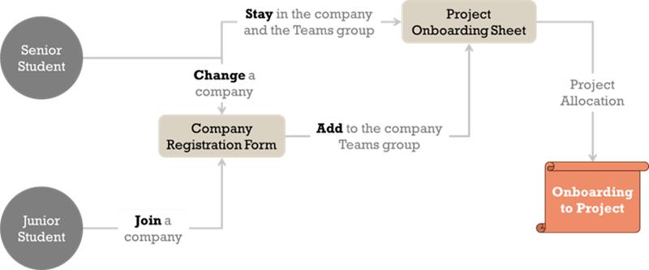

Welcome to Hardhat Enterprises! We are thrilled that you have chosen to join our team. This guide will provide you with a quick overview to help you get started. Let's dive in!

## Onboarding Process

Things have changed commencing in Trimester 1, 2024. All students are required to complete the onboarding process. This includes both senior students returning to capstone and junior students. This will allow our leadership team to effectively allocate students to their respective projects based on skills, project needs and student preference. 

### Senior Students

1. Maintaining Company
    - Skip the company registration form if staying in the same company.
    - Proceed directly to filling in the project onboarding sheet.
    - Await project allocation by the company leadership group.

2. Changing Company
    - Fill in the company registration form with a "Change A Company" request.
    - Upon approval, transition from the current company's teams site to the new one.
    - Complete the project onboarding sheet for the new project.
    - Await project allocation by the company leadership group.

The company registration form for Hardhat Enterprises can be found in the MS Teams General Channel [here](https://teams.microsoft.com/l/channel/19%3AUyQ99TU7D96nrz_zHQu-rX8LFhmTyYGjWTjwJ9eSUfY1%40thread.tacv2/General?groupId=5a1ff33f-ed52-4b5b-a88d-1e43b347b0ab&tenantId=d02378ec-1688-46d5-8540-1c28b5f470f6).

### Junior Students

1. Complete the company registration form found with the MS Team Capstone A unit site.
2. Wait for project allocation (usually 24-48hrs) by teaching staff.
3. Complete the project onboarding sheet.
4. Wait for project allocation and complete project specific onboarding instructions from your project lead once issued.

## Company Leadership
### Leadership Style
In Hardhat Enterprises, we embrace a decentralised leadership structure. This approach empowers individuals at all levels of the organization to make decisions and take ownership of their work. Rather than relying on a top-down hierarchy, we distribute leadership responsibilities across teams and encourage collaboration and autonomy. This allows us to tap into the diverse skills and perspectives of our team members, fostering innovation and adaptability. By promoting a decentralised leadership structure, we create an environment that values initiative, accountability, and continuous learning.

Students aiming to achieve high-letter grades must demonstrate leadership and technical contributions. Anyone can be a leader!

### The Three C's
Our operations are based on what we call the "Three C's". Code, Communication and Coordination. Each of these Three C's has a designated student lead. 

#### Code
In Hardhat we use Github as our central code repository. We use a single Github organisation that allows all students to access repositories to make technical contributions. We have git leads assisted by the code lead, who help to manage and coordinate activities and agreed policies. If you have a good knowledge of Github you can contribute signifficantly in this area!

They're also our Github admins. Checkout our Github guide [here](../github-guide).

#### Communication
In Hardhat Enterprises, we prioritise effective communication among team members. We utilise Microsoft Teams as our primary platform for direct communication, allowing for seamless collaboration and quick information sharing. Additionally, we use OnTrack for submitting project deliverables and tracking progress. This combination of MS Teams and OnTrack ensures efficient and organised communication channels throughout the project lifecycle.

They're our gateway to the teaching staff and MS Teams. Checkout our Teams guide [here](../teams-guide).

#### Coordination
The coordination lead plays a crucial role in ensuring effective coordination within Hardhat Enterprises. As part of our SCRUM framework, the coordination lead is responsible for student allocation to projects, coordinating inquiries to the right people, and liaising with the teaching team when necessary. Their expertise in project management and communication allows for seamless coordination among team members, ensuring that tasks are assigned appropriately and progress is tracked effectively. With their guidance, our teams can work together efficiently and deliver high-quality results.

They're also our Trello admins. Checkout our Trello guide [here](../trello-guide).

## What now?

Before you complete your onboarding process you should refamiliarise yourself with the projects on offer this trimester. A guide to our projects can be found [here]().

1. Complete the onboarding process and select your primary and secondary preferences for project selection.
2. [Join our Trello workspace](../trello-guide).
3. [Explore the Github organisation](../github-guide).
4. Consider volunteering to become a lead!
5. Checkin with your project lead in the corresponding teams channel.
6. Consult the FAQ.
7. Familiarise yourself with the OnTrack tasks.
8. Get ready to kick start the trimester. Good luck!